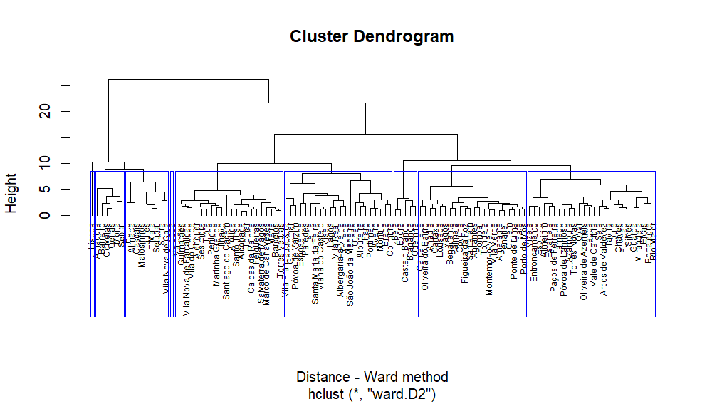

```{r setup, include=FALSE}
knitr::opts_chunk$set(echo = TRUE)
```

Script for a site selection - [Streets4All](https://streets4all.pt/) Project.


### About

SiteSelection aims to find areas for a dynamic street realocation experiment.

It selects the cell locations of a giver city or neighborhood where the street space is more disputed by different transport modes and street activities. 
SiteSelection is a full script that uses a dynamic pipeline, and gathers and processes information on:

* Population density
* Road network centrality measures
* Traffic levels
* Public Transit demand
* POI and activities

This work is part of [Streets4All Project](https://streets4all.tecnico.ulisboa.pt), developed at the University of Lisbon and at the University of Coimbra, and funded by Fundação para a Ciência e Tecnologia (PT).

## Sources

The SIteSelection package is based in Portuguese open datasets, such as census and GTFS data.

Although it is easy to run for any location in Portugal, you may adapt the code to run at other locations (considering you have the similar data needed).

Data needed for other locations:

* Census data (population and buildings)
* GTFS data
* Administrative boundaries


## Setup

Requires [`targets`](https://books.ropensci.org/targets/) R package.

```{r eval=FALSE}
library(targets)
tar_visnetwork()
```
```{r echo=FALSE}
# requires targets

```

And you should have something like this

```{r eval=FALSE}
tar_load(candidates_centrality)
mapview::mapview(candidates_centrality)
```
```{r echo=FALSE}

```

_Work in Progress_
