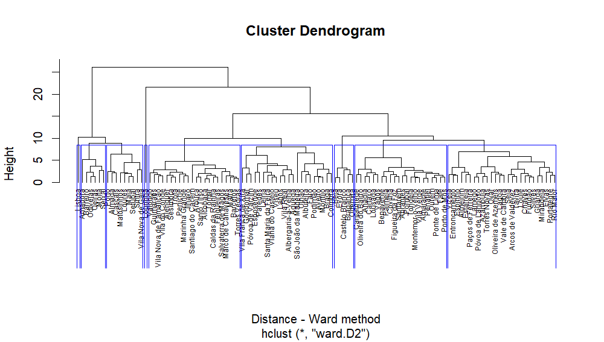

SiteSelection
================

Script for a site selection - [Streets4All](https://streets4all.pt/)
Project.

### About

SiteSelection aims to find areas for a dynamic street realocation
experiment.

It selects the cell locations of a giver city or neighborhood where the
street space is more disputed by different transport modes and street
activities. SiteSelection is a full script that uses a dynamic pipeline,
and gathers and processes information on:

- Population density
- Road network centrality measures
- Traffic levels
- Public Transit demand
- POI and activities

This work is part of Streets4All Project, developed at the University of
Lisbon and at the University of Coimbra, and funded by Fundação para a
Ciência e Tecnologia (PT).

## Setup

Requires [`targets`](https://books.ropensci.org/targets/) R package.

``` r
library(targets)
tar_visnetwork()
```



*Work in Progress*
