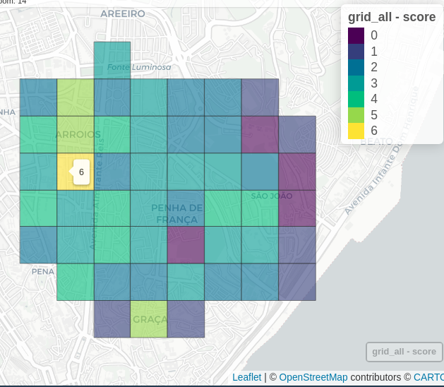

SiteSelection
================

Script for a site selection - [Streets4All](https://streets4all.pt/)
Project.

### About

SiteSelection aims to find areas for a dynamic street realocation
experiment.

It selects the cell locations of a giver city or neighborhood where the
street space is more disputed by different transport modes and street
activities. SiteSelection is a full script that uses a dynamic pipeline,
and gathers and processes information on:

- Population density
- Road network centrality measures
- Traffic levels
- Public Transit demand
- POI and activities

This work is part of [Streets4All
Project](https://streets4all.tecnico.ulisboa.pt), developed at the
University of Lisbon and at the University of Coimbra, and funded by
Fundação para a Ciência e Tecnologia (PT).

## Sources

The SIteSelection package is based in Portuguese open datasets, such as
census and GTFS data.

Although it is easy to run for any location in Portugal, you may adapt
the code to run at other locations (considering you have the similar
data needed).

Data needed for other locations:

- Census data (population and buildings)
- GTFS data
- Administrative boundaries

## Setup

### Requirements

- QGis and qgis_process installed and working
- [`targets`](https://books.ropensci.org/targets/) R package.
- [`siteselection`]() R package \[*under development*\].

### Run

``` r
library(targets)
tar_visnetwork()
```


And you should have something like this

``` r
tar_make(CITY == "Lisboa")
# let it run

tar_load(candidates_centrality)
mapview::mapview(candidates_centrality)
```



When the process is not complete, you may have an error like this

``` r
tar_visnetwork()
```


*Work in Progress*
