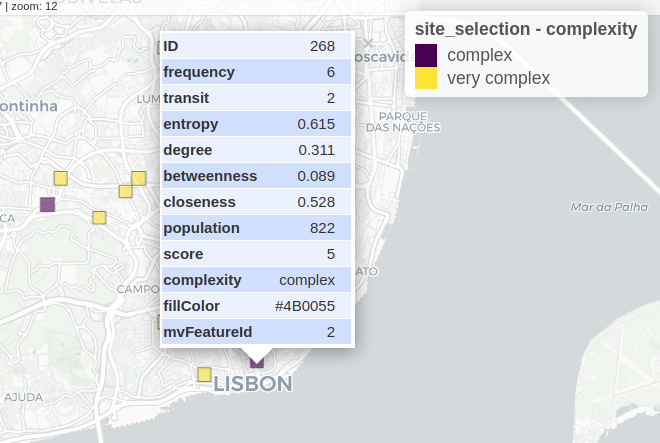

SiteSelection
================

**SiteSelection** aims to find areas for a dynamic street re-allocation
experiment.

It consist in a process of multi criteria to select the cell locations
of a giver city or neighborhood where the street space is more disputed
by different transport modes and street activities. SiteSelection is a
full script that uses a dynamic pipeline, and gathers and processes
information on:

- Road network centrality measures (betweeness, closeness, degree)
- Population density
- POI and activities
- Public Transit demand
- Traffic levels (*TBC*)

## Sources

The SiteSelection package is based in Portuguese open datasets, such as
census and GTFS data.

Although it is easy to run for any location in Portugal, you may adapt
the code to run at other locations (considering you have the similar
data needed).

Data needed for other locations:

- Census data (population and buildings)
- POIs (see
  [data_extract.R](https://github.com/U-Shift/SiteSelection/blob/fc0bce07acf3b60ce0bfe1d26511acd7c2d5c083/code/data_extract.R#L146))
- GTFS data (see
  [transit.R](https://github.com/U-Shift/SiteSelection/blob/main/code/transit.R))
- Administrative boundaries

## Setup

### Requirements

- QGis and [`qgis_process`](https://r-spatial.github.io/qgisprocess/)
  installed and working
- [`targets`](https://books.ropensci.org/targets/) R package.
- [`siteselection`]() R package \[*under development*\].

### Change defaults

Open the `_targets.R` file and change the defaults to your needs (don’t
forget to save the file before run!):

``` r
# Set defaults HERE ######################
CITY_input = "Almada"       # Municipality name in Portugal
GEOJSON = TRUE             # use a different limit? made with https://geojson.io/ and saved in inputdata/*.geojson
GEOJSON_input = "map1"      # name of the file if GEOJSON = TRUE. default: "map1"
cellsize_input = c(400, 400)# in meters
square_input = TRUE         # TRUE = squares, FALSE = hexagons
build_osm = FALSE           # build and clean osm road network again?
analysis = FALSE            # export input parameters and results to a xls file? default: FALSE

# Thresholds
population_min = median     # mean or median? default: mean
degree_min = mean           # mean or median? default: mean
betweeness_range = 0.40     # percentile to exclude (upper and lower) default: 0.25
closeness_range = 0.25      # value to exclude (upper and lower) default: 0.25
entropy_min = 0.35          # value to exclude (lower) default: 0.5
freq_bus = c(4, 10, 20)     # frequency of bus stops to define level of service. last 2 will remain. default: c(4, 10, 20) 
```

### Run the pipeline

``` r
library(targets)
tar_visnetwork(targets_only = TRUE) # or false, to show objects
```

And you should have something like this


``` r
tar_make()
# let it run

tar_load(grid_all)
mapview::mapview(grid_all, zcol="score") #ranked cells
```


If you want to see the filtered cells (candidates), you can load the
`site_selection` object and plot it, with *complex* and *very complex*
cells (transit layer considered).

``` r

```


When the process is not complete, you may have an error like this

``` r
tar_visnetwork()
```


### Work with non-administrative boundary

You can set another polygon limit to the analysis.  
Just [create a .geojson file](https://geojson.io/) with the area of
interest and save it in the `inputdata` folder.  
Then, set the `GEOJSON = TRUE` and `GEOJSON_input` to the name of the
file, without the extension.

### Analysis

If you want to analyze the results in detail, set `analysis = TRUE` in
`_targets.R` and load the analysis/analysis.table.Rds or .xlsx. It
includes sequential runs with all inputs, outputs, and variable
statistics.

*Work in Progress…*

## Citation

This work is part of [Streets4All
Project](https://streets4all.tecnico.ulisboa.pt), developed at the
University of Lisbon and at the University of Coimbra, and funded by
Fundação para a Ciência e Tecnologia (PT).

The concept is based in:  
Valença, G., Moura, F., & Morais de Sá, A. (2023). Where is it complex
to reallocate road space? *Environment and Planning B: Urban Analytics
and City Science*, 0(0). <https://doi.org/10.1177/23998083231217770>.

Please refer to this work as:  
Félix R, Gabriel V (2024). *SiteSelection: A script for a site selection
for the Streets4All Project*. R package version 0.1,
<https://github.com/U-Shift/SiteSelection/>.
